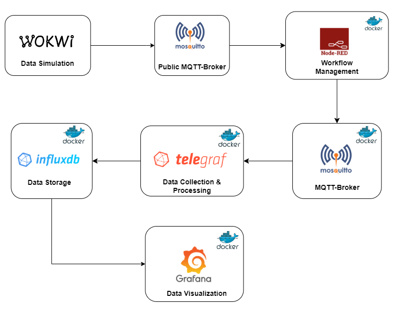

# Electricity Monitoring IoT Project

## Introduction

This project is designed to monitor and analyze electricity usage using a combination of IoT technologies. It showcases real-time data such as current, power, voltage, frequency, and energy consumption. The project integrates Wokwi for data simulation, Node-RED for workflow management, Telegraf and InfluxDB for data processing, and Grafana for dashboard visualization. It also includes features for calculating energy consumption and the cost of electricity used.

## System Dashboard

<p align="center">
  
</p>

### Overview

The system architecture comprises several interconnected components that work together to provide real-time electricity usage data and analytics:

- **Wokwi**: Used for simulating IoT devices and sensors for electricity data generation.
- **Node-RED**: Manages the flow of data from Wokwi simulations to the data processing pipeline.
- **Telegraf**: Acts as an agent for collecting, processing, and aggregating data.
- **InfluxDB**: Stores time-series data for further analysis.
- **Grafana**: Visualizes the data through comprehensive dashboards.

## Built with

[![Docker][Docker.com]][Docker-url][![MQTT][MQTT.com]][MQTT-url][![Telegraf][Telegraf.org]][Telegraf-url][![InfluxDB][InfluxDB.com]][InfluxDB-url][![Grafana][Grafana.com]][Grafana-url][![Nodered][Nodered.org]][Nodered-url]

### Diagram

<p align="center">
  
</p>

## Prerequisites

Before starting with the project setup, ensure the following prerequisites are met:

- Docker
- Access to wokwi on web

# IoT Electricity Monitoring Project - Data Flow

## 1. Data Simulation (Wokwi)
- **Description**: The flow begins with Wokwi simulating IoT devices and sensors.
- **Data Generated**: These devices generate electricity data such as current, power, voltage, frequency, and energy consumption.

## 2. Workflow Management (Node-RED)
- **Data Reception**: The simulated data from Wokwi is then sent to Node-RED.
- **Function**: Node-RED, also dockerized, manages and orchestrates the flow of this data.
- **Processing**: It processes and formats the data, preparing it for collection and storage.

## 3. Data Collection & Processing (Telegraf)
- **Collection**: Telegraf, running in its own Docker container, collects the processed data from Node-RED.
- **Role**: It acts as an agent that further processes and aggregates the data.
- **Efficiency**: Telegraf ensures efficient data handling before storage.

## 4. Data Storage (InfluxDB)
- **Storage**: The aggregated data is then stored in InfluxDB.
- **Infrastructure**: InfluxDB, dockerized for consistency and scalability, stores this time-series data.
- **Retrieval**: It facilitates efficient data retrieval for analysis and visualization.

## 5. Data Visualization (Grafana)
- **Visualization**: Finally, the data stored in InfluxDB is visualized using Grafana.
- **Dashboard Creation**: Grafana, also running in a Docker container, creates interactive dashboards.
- **Display**: These dashboards display real-time data on current, power, voltage, frequency, and energy consumption.

**Note**: Each component runs in a separate Docker container, which provides isolation, scalability, and easy deployment. The dockerization of each component also simplifies version control, dependency management, and environment consistency across different platforms.

## Usage

This section provides a step-by-step guide on how to use the IoT Electricity Monitoring Project.

1. **Access Wokwi**:
   - Open your web browser and navigate to [Wokwi](https://wokwi.com/).
   - Log in to your Wokwi account, or sign up if you don't have an account yet.

2. **Set Up Simulations**:
   - Once logged in, navigate to the project section or start a new project.
   - Copy the code from wokwi.txt and paste in the project.
   - Save the project.

3. **Run Simulations**:
   - Start the simulation by clicking on the 'Run' or 'Start' button in Wokwi.
   - Ensure that the simulated data is accessible and can be sent to an external service like Node-RED.

4. Ensure Docker is installed on your machine. Visit [Docker's official website](https://www.docker.com/get-started) for installation instructions.

5. Clone the repo
   ```sh
   git clone https://github.com/Lindbrum/IoT-23-24-Final-NiDaGi
   ```
6. Run the containers
   ```sh
   docker-compose up
   ```


## Acknowledgements

* [Dario ](https://github.com/)
* [Nimrah](https://github.com/)
* [Giovanni](https://github.com/)

<!-- MARKDOWN LINKS & IMAGES -->
[Docker.com]: https://img.shields.io/badge/docker-%230db7ed.svg?style=for-the-badge&logo=docker&logoColor=white
[Docker-url]: https://www.docker.com/
[InfluxDB.com]: https://img.shields.io/badge/InfluxDB-22ADF6?style=for-the-badge&logo=InfluxDB&logoColor=white
[InfluxDB-url]: https://www.influxdata.com/
[Nodered.org]: https://camo.githubusercontent.com/dba888e83b867790301211b790aa54bbcd0829d8b87d9601adc04bc1d408c4f6/68747470733a2f2f696d672e736869656c64732e696f2f7374617469632f76313f7374796c653d666f722d7468652d6261646765266d6573736167653d4e6f64652d52454426636f6c6f723d384630303030266c6f676f3d4e6f64652d524544266c6f676f436f6c6f723d464646464646266c6162656c3d
[Nodered-url]: https://nodered.org/
[Grafana.com]: https://camo.githubusercontent.com/bc49cd42967fc5be8c364ddf4fa16008584815a3bec1d461dfc5c7214b345238/68747470733a2f2f696d672e736869656c64732e696f2f7374617469632f76313f7374796c653d666f722d7468652d6261646765266d6573736167653d47726166616e6126636f6c6f723d463436383030266c6f676f3d47726166616e61266c6f676f436f6c6f723d464646464646266c6162656c3d
[Grafana-url]: https://grafana.com/
[Telegraf.org]: https://camo.githubusercontent.com/38de238268b31df333bd3bdca46953582a42b528390cef904aea00660d0b918d/68747470733a2f2f696d672e736869656c64732e696f2f7374617469632f76313f7374796c653d666f722d7468652d6261646765266d6573736167653d54656c65677261706826636f6c6f723d323232323232266c6f676f3d54656c656772617068266c6f676f436f6c6f723d464146414641266c6162656c3d
[Telegraf-url]: https://www.influxdata.com/time-series-platform/telegraf/
[MQTT.com]: https://camo.githubusercontent.com/7032ff43ba978eff463cbbd12e4f747102e73b3cd71bc626171e1e0487099432/68747470733a2f2f696d672e736869656c64732e696f2f7374617469632f76313f7374796c653d666f722d7468652d6261646765266d6573736167653d4d51545426636f6c6f723d363630303636266c6f676f3d4d515454266c6f676f436f6c6f723d464646464646266c6162656c3d
[MQTT-url]: https://mqtt.org/
